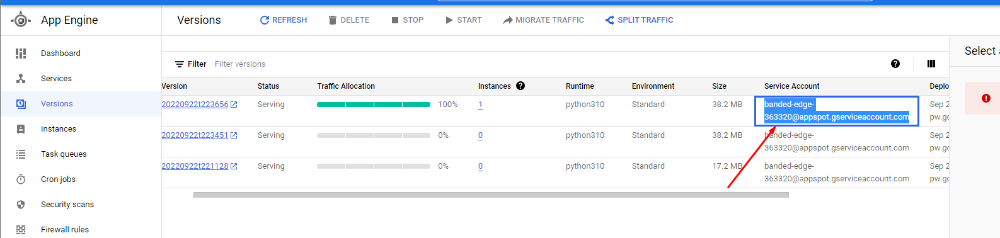
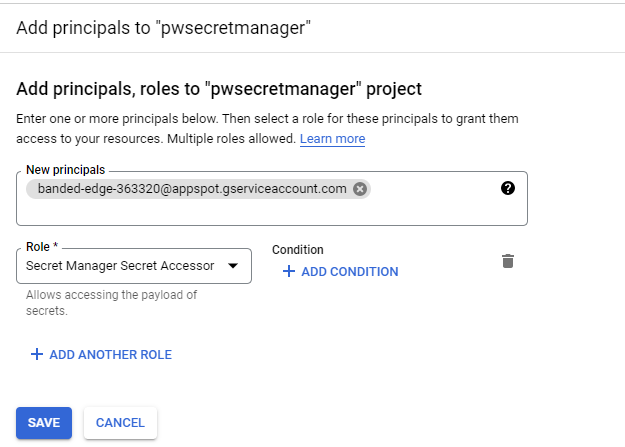
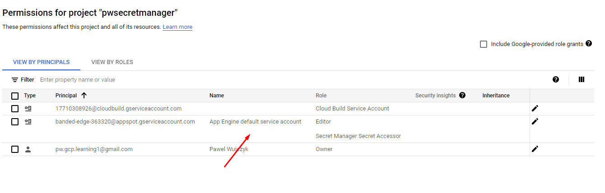

<!--Category:C#,SQL--> 
 <p align="right">
    <a href="http://productivitytools.tech/productivitytools-createsqlserverdatabase/"><a> 
    <a href="https://github.com/ProductivityTools-Learning/ProductivityTools.Example.GCP.SecretManager"></a>
</p>
<p align="center">
    <a href="http://http://productivitytools.tech/">
        
    </a>
</p>

# GCP.SecretManager

This is a simple python app which returns value from the Secret Manager and app is deployed as Google App Engine

<!--more-->

- Hello under http://127.0.0.1:8080/Hello
- Secret under http://127.0.0.1:8080/Secret


```
gcloud app create --project banded-edge-363320
gcloud app deploy
```
## Tutorial
[Link](https://cloud.google.com/secret-manager/docs/create-secret)
[Enabble API](https://console.cloud.google.com/flows/enableapi?apiid=secretmanager.googleapis.com&redirect=https://console.cloud.google.com&_ga=2.84762201.1798303247.1663912530-522909522.1663443612)


```
gcloud secrets list
echo -n "pwValue" | gcloud secrets versions add pwsecret --data-file=-
```

If you face the error


Add **Secret Manager Secret Accessor** for the App engine Service Account

Copy Service account name



Add it in the IAM 




