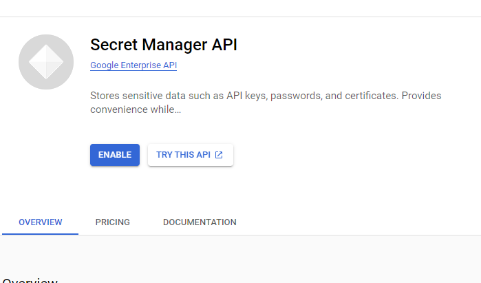

<!--Category:C#,SQL--> 
 <p align="right">
    <a href="http://productivitytools.tech/productivitytools-createsqlserverdatabase/"><a> 
    <a href="https://www.github.com/pwujczyk/ProductivityTools.CreateSQLServerDatabase"></a>
</p>
<p align="center">
    <a href="http://http://productivitytools.tech/">
        
    </a>
</p>

# GCP.SecretManager

This is a simple python app which returns

- Hello under http://127.0.0.1:8080/Hello
- Secret under http://127.0.0.1:8080/Secret


```
gcloud app create --project banded-edge-363320
gcloud app deploy
```
## Tutorial
[Link](https://cloud.google.com/secret-manager/docs/create-secret)



```
echo -n "pwValue" | gcloud secrets versions add pwsecret --data-file=-
gcloud secrets list
```